AWS Event Driven Serverless Pipeline

Event driven serverless architecture built on AWS using S3, SNS, SQS, Lambda and DynamoDB.

This project demonstrates a simple event driven pipeline where uploading a file to Amazon S3 automatically triggers multiple independent processing steps.

Instead of sending the upload directly to a single processor, the system publishes an event and allows different consumers to react to it independently. This keeps the system loosely coupled and makes it easier to scale or extend later.

Architecture

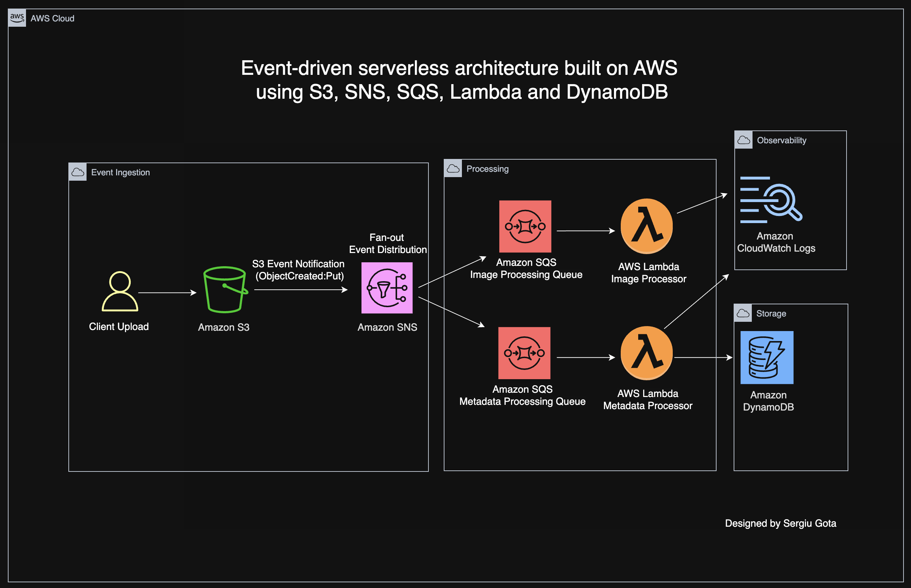

How the system works

1. A client uploads a file to Amazon S3
2. S3 generates an ObjectCreated event
3. The event is sent to an SNS topic
4. SNS distributes the message to multiple SQS queues
5. Each queue triggers a different Lambda function
6. The metadata Lambda extracts information from the event
7. The metadata is stored in DynamoDB
8. Lambda executions are recorded in CloudWatch Logs

Architecture decisions

Amazon S3

S3 is used as the entry point of the system.

Why this service was used

1. Highly durable object storage
2. Built in event notification system
3. Direct integration with other AWS services

Amazon SNS

SNS is responsible for distributing the upload event.

Why this service was used

1. Enables fan out messaging
2. Multiple consumers can react to the same event
3. Keeps producers and consumers independent

Amazon SQS

SQS queues sit between the event layer and the compute layer.

Two queues are used

Image processing queue  
Metadata processing queue

Why this service was used

1. Decouples services
2. Buffers traffic spikes
3. Ensures reliable message delivery
4. Enables asynchronous processing

AWS Lambda

Lambda functions process messages coming from the queues.

Two functions exist in this project

image processor  
metadata processor

Why this service was used

1. Serverless compute
2. Automatic scaling
3. No infrastructure management
4. Native integration with SQS

Amazon DynamoDB

DynamoDB stores metadata extracted from the uploaded file event.

Why this service was used

1. Serverless NoSQL database
2. Low latency reads and writes
3. Automatically scales with workload

Amazon CloudWatch Logs

CloudWatch is used to observe Lambda execution and debug the event flow.

Why this service was used

1. Centralized logging
2. Debugging serverless workloads
3. Visibility into event processing

Project structure

aws-event-driven-serverless-pipeline  
│  
├── architecture  
│   └── architecture-diagram.png  
│  
├── lambda  
│   ├── image-processor.py  
│   └── metadata-processor.py  
│  
├── screenshots  
│   ├── 01_s3_bucket.png  
│   ├── 02_s3_event_notification.png  
│   ├── 03_sns_topic.png  
│   ├── 04_sqs_queues.png  
│   ├── 05_sns_subscriptions.png  
│   ├── 06_lambda_functions.png  
│   ├── 07_lambda_triggers.png  
│   ├── 08_dynamodb_table.png  
│   ├── 09_cloudwatch_logs.png  
│   └── 10_dynamodb_result.png  
│  
├── README.md  
├── LICENSE  
└── .gitignore  

Screenshots

The following screenshots show the architecture components and the system running inside AWS.

S3 bucket

The S3 bucket used for uploads and the folder that triggers the event pipeline.

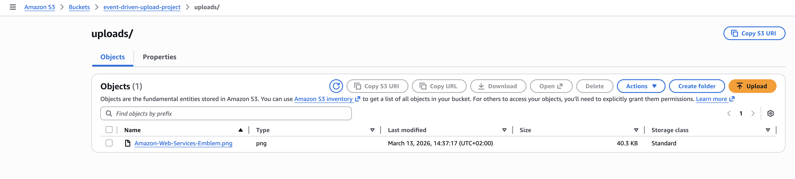

S3 event notification

Configuration of the ObjectCreated event that sends notifications to the SNS topic.

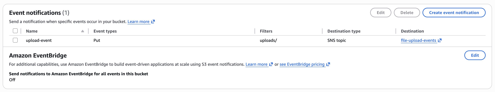

SNS topic

SNS topic responsible for distributing the upload event to multiple consumers.

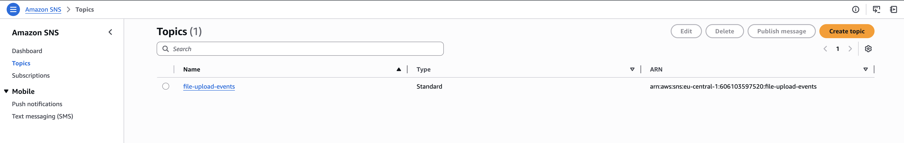

SQS queues

Two SQS queues used to decouple the processing layer.

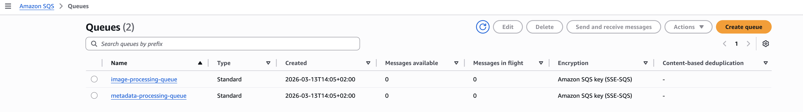

SNS subscriptions

Subscriptions connecting the SNS topic to the two SQS queues.

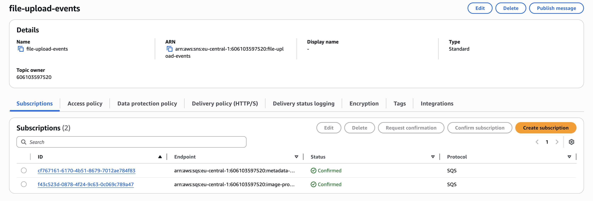

Lambda functions

The two serverless functions responsible for processing events from the queues.

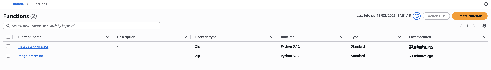

Lambda triggers

Event source mapping showing how SQS triggers each Lambda function.

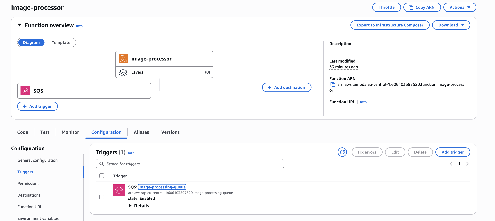

DynamoDB table

The DynamoDB table used to store metadata extracted from the upload event.

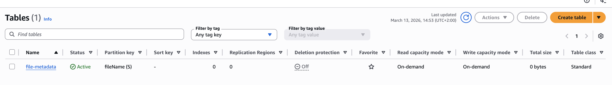

CloudWatch logs

Execution logs generated by the Lambda functions during event processing.

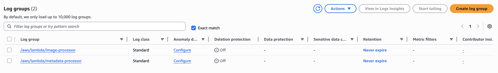

DynamoDB result

Example record written to DynamoDB after the upload event is processed.

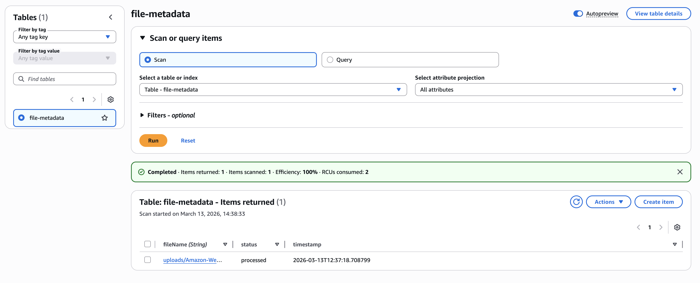

Things I learned while building this

Building the architecture in the AWS console highlighted how important service permissions are. S3 cannot publish to SNS without the correct topic policy, and Lambda cannot read from SQS without the proper IAM role permissions.

Another useful takeaway was how SQS helps decouple systems. Even though both Lambda functions react to the same upload event, they operate independently and can scale separately.

Working with the event payload also helped clarify how AWS services pass structured events through multiple layers. The Lambda functions unpack the SQS message, then the SNS message, and finally the original S3 event to extract the file information.

Seeing the full flow from S3 upload to a DynamoDB record reinforced how powerful serverless architectures can be when services communicate through events instead of direct service calls.
