# AWS Event-Driven Serverless Pipeline
### S3 · SNS · SQS · Lambda · DynamoDB

[](https://aws.amazon.com/)
[](https://aws.amazon.com/s3/)
[](https://aws.amazon.com/sns/)
[](https://aws.amazon.com/sqs/)
[](https://aws.amazon.com/lambda/)
[](https://aws.amazon.com/dynamodb/)

---

## Overview

This project implements an event-driven serverless pipeline on AWS. Uploading a file to Amazon S3 automatically triggers multiple independent processing steps — without any direct coupling between the services involved.

Instead of routing the upload event to a single processor, the system publishes it to SNS, which fans the message out to multiple SQS queues. Each queue triggers a dedicated Lambda function that handles its own processing independently. This keeps the architecture loosely coupled, resilient to partial failures, and straightforward to extend with additional consumers later.

---

## Architecture

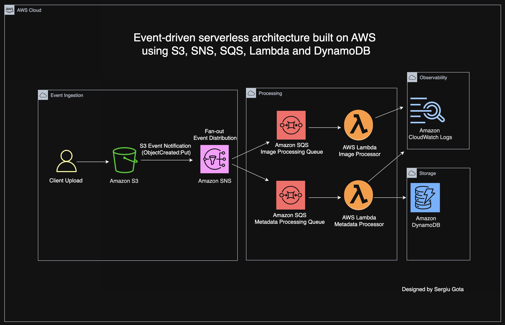

```
Client (File Upload)
      │
      │  PutObject
      ▼
Amazon S3  ── Generates ObjectCreated event on file upload
      │
      ▼
Amazon SNS  ── Fan-out: distributes the event to all subscribers
      │
      ├──────────────────────┐
      ▼                      ▼
SQS Queue               SQS Queue
(Image Processing)      (Metadata Processing)
      │                      │
      ▼                      ▼
AWS Lambda              AWS Lambda
(image-processor)       (metadata-processor)
                               │
                               ▼
                        Amazon DynamoDB  ── Stores extracted file metadata
                               │
                        Amazon CloudWatch  ── Records Lambda execution logs
```

---

## Services Used

| Service | Role |
|---|---|
| **Amazon S3** | Entry point — stores uploaded files and generates ObjectCreated events |
| **Amazon SNS** | Fan-out messaging — distributes each upload event to all subscribed queues |
| **Amazon SQS** | Decoupling layer — buffers messages between SNS and Lambda processors |
| **AWS Lambda** | Compute — two independent functions process events from their respective queues |
| **Amazon DynamoDB** | Persistence — stores file metadata extracted by the metadata processor |
| **Amazon CloudWatch** | Observability — captures execution logs for all Lambda invocations |
| **AWS IAM** | Security — grants each service least-privilege access to what it needs |

---

## Application Flow

1. A client uploads a file to the designated folder in the S3 bucket
2. S3 generates an `ObjectCreated` event and publishes it to the SNS topic
3. SNS fans the message out to both subscribed SQS queues simultaneously
4. The image processing queue delivers its message to the `image-processor` Lambda
5. The metadata processing queue delivers its message to the `metadata-processor` Lambda
6. Both Lambda functions execute independently — neither is aware of the other
7. The `metadata-processor` unpacks the SQS envelope, then the SNS envelope, then the original S3 event to extract file information
8. The extracted metadata is written as a record to DynamoDB
9. Execution logs for both functions are captured in CloudWatch Logs

---

## Project Structure

```
aws-event-driven-serverless-pipeline/
│
├── architecture/
│   └── architecture-diagram.png          # End-to-end pipeline architecture
│
├── lambda/
│   ├── image-processor.py                # Lambda handler for image processing queue
│   └── metadata-processor.py            # Lambda handler for metadata processing queue
│
├── screenshots/
│   ├── 01_s3_bucket.png                  # S3 bucket and upload folder configuration
│   ├── 02_s3_event_notification.png      # ObjectCreated event notification to SNS
│   ├── 03_sns_topic.png                  # SNS topic receiving S3 events
│   ├── 04_sqs_queues.png                 # Both SQS queues in the processing layer
│   ├── 05_sns_subscriptions.png          # SNS subscriptions to each SQS queue
│   ├── 06_lambda_functions.png           # Both Lambda functions deployed
│   ├── 07_lambda_triggers.png            # SQS event source mappings for each function
│   ├── 08_dynamodb_table.png             # DynamoDB table schema and configuration
│   ├── 09_cloudwatch_logs.png            # Lambda execution logs in CloudWatch
│   └── 10_dynamodb_result.png            # Example metadata record written to DynamoDB
│
├── README.md
├── LICENSE
└── .gitignore
```

---

## Screenshots

### 1. S3 Bucket
*The S3 bucket used for uploads, with the folder prefix configured to trigger the event pipeline.*

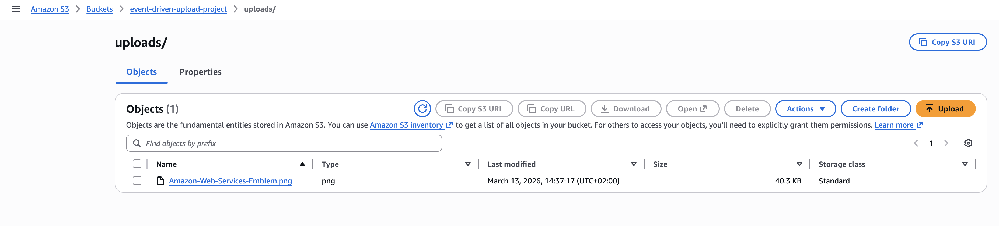

---

### 2. S3 Event Notification
*ObjectCreated event notification configured to publish to the SNS topic on every file upload.*

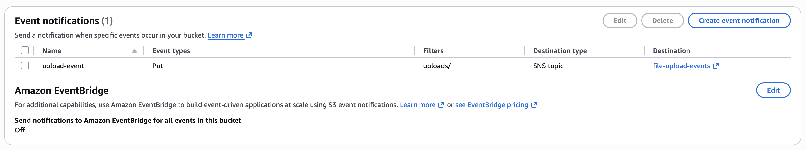

---

### 3. SNS Topic
*SNS topic responsible for receiving the S3 event and distributing it to all subscribed queues.*

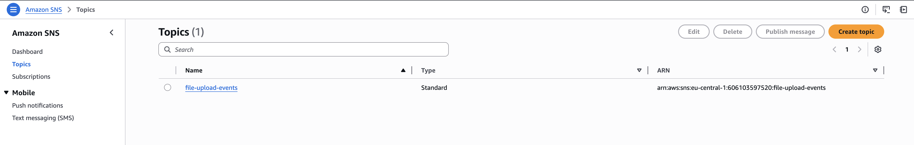

---

### 4. SQS Queues
*Both SQS queues — image processing and metadata processing — sitting between the event and compute layers.*

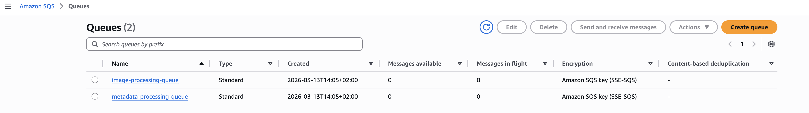

---

### 5. SNS Subscriptions
*Subscriptions connecting the SNS topic to each SQS queue, enabling independent fan-out delivery.*

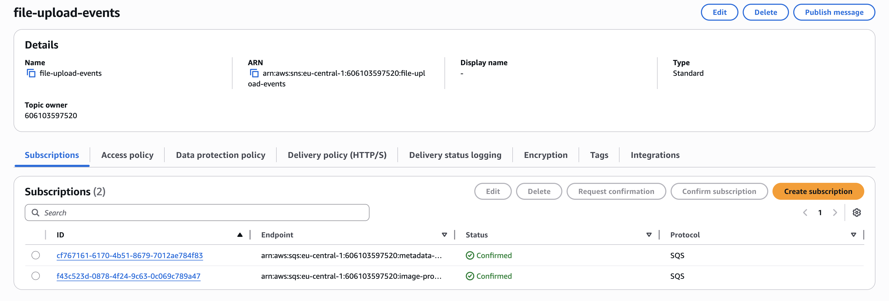

---

### 6. Lambda Functions
*Both serverless functions deployed and configured to process messages from their respective queues.*

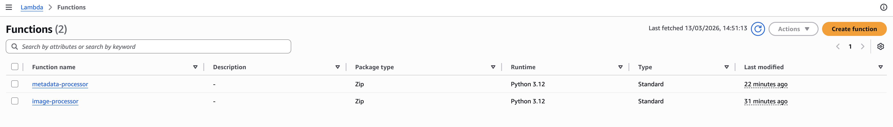

---

### 7. Lambda Triggers
*Event source mappings showing each SQS queue connected to its corresponding Lambda function.*

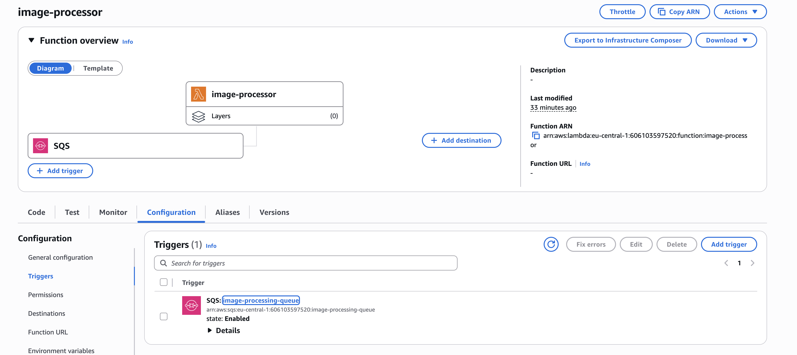

---

### 8. DynamoDB Table
*DynamoDB table configured to store metadata records written by the metadata-processor function.*

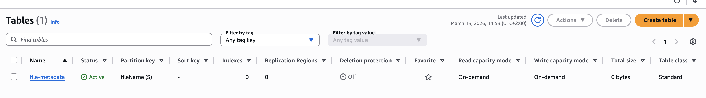

---

### 9. CloudWatch Logs
*Execution logs generated by both Lambda functions, confirming successful event processing.*

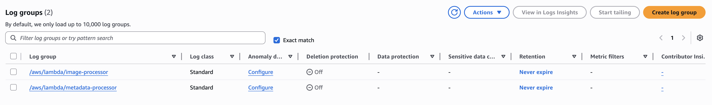

---

### 10. DynamoDB Result
*Example metadata record persisted in DynamoDB after an end-to-end upload event is processed.*

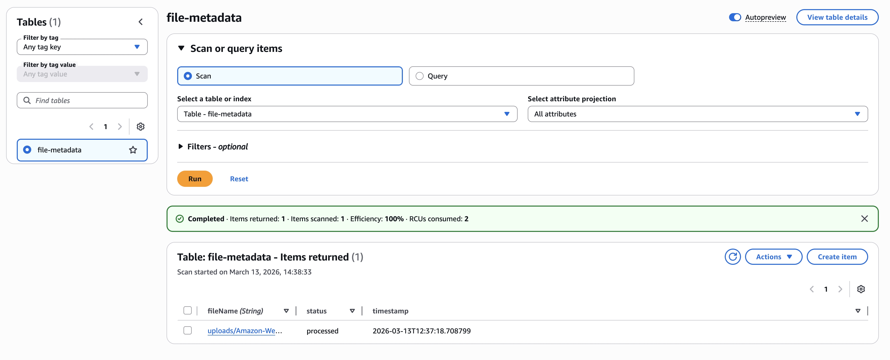

---

## Troubleshooting

### 1. S3 Events Not Reaching SNS Due to Missing Topic Policy

After configuring the S3 event notification to publish to the SNS topic, uploads to the bucket were completing successfully but no messages were appearing in the SQS queues. CloudWatch showed no Lambda invocations, and the SNS topic metrics showed zero publish attempts.

The root cause was a missing resource-based policy on the SNS topic. By default, SNS topics reject publish requests from any AWS service that isn't explicitly permitted in the topic policy — including S3. S3 event notifications use the `sns:Publish` action under the S3 service principal, and without a policy statement explicitly allowing `Service: s3.amazonaws.com` to call `sns:Publish` on the topic ARN, S3 silently drops the notification without returning an error to the upload caller.

**Fix:** Added a resource-based policy to the SNS topic granting `sns:Publish` to the S3 service principal, scoped to the specific bucket ARN as the source. Confirmed the fix by uploading a test file and observing the message appear in both SQS queues within seconds.

**Lesson:** In event-driven architectures on AWS, every cross-service publish or invoke requires an explicit permission on the receiving resource — not just on the sending identity. When an event notification appears to be configured correctly but nothing arrives downstream, always check the resource policy on the target service first.

---

### 2. Lambda Failing to Parse Nested Event Envelope

After permissions were in place and messages were flowing into the SQS queues, the `metadata-processor` Lambda was being triggered but failing on every invocation. CloudWatch Logs showed a `KeyError` on the first line of the handler that attempted to extract the S3 object key.

The issue was in how the event payload is structured when S3 publishes through SNS to SQS. The Lambda receives an SQS event — the S3 notification is not the top-level object. It is nested three levels deep: the SQS `Records` array wraps the SNS message, the SNS message body wraps the S3 event JSON as a string, and the S3 event itself contains the object key inside another `Records` array. The handler was attempting to access the S3 key directly from the top-level event, which doesn't exist at that level.

**Fix:** Updated the handler to unpack the envelope in the correct order — first extracting `event['Records'][0]['body']` from the SQS wrapper, then calling `json.loads()` on that string to get the SNS message, then accessing `sns_message['Message']` and calling `json.loads()` again to get the S3 event, and finally reading the object key from `s3_event['Records'][0]['s3']['object']['key']`.

**Lesson:** When AWS services chain events through SNS and SQS, each layer wraps the previous message as a serialised string — not a nested dict. Always parse each envelope explicitly with `json.loads()`, and log the raw event body on the first invocation of any new Lambda so you can see the exact structure before writing extraction logic.

---

## What I Learned

This project made the value of loose coupling tangible in a way that reading about it does not.

**Fan-out messaging changes how you think about system boundaries.** In a tightly coupled design, adding a second consumer to an upload event means modifying the existing processor or adding branching logic. With SNS fan-out, adding a new consumer is a matter of creating a new SQS subscription — the S3 bucket, the SNS topic, and every existing consumer remain completely unchanged. The architecture absorbs the new requirement without touching anything that was already working.

**Service permissions are the connective tissue of event-driven systems.** The pipeline has six services, and almost every hop between them requires an explicit permission — S3 publishing to SNS, SNS delivering to SQS, Lambda reading from SQS, Lambda writing to DynamoDB. Getting each of these right requires understanding both the identity-based policies on the acting service and the resource-based policies on the receiving service. When a hop fails silently, it is almost always a missing permission somewhere in that chain.

**Nested event envelopes are a recurring pattern worth internalising.** Every AWS service that passes events through an intermediary — SNS, SQS, EventBridge — wraps the original message in its own envelope. Lambda functions that process these chains need to unwrap each layer explicitly. Understanding this pattern once means recognising it immediately in every future serverless integration, rather than rediscovering it through a `KeyError` each time.

**Serverless observability requires intentional logging at every layer.** With no persistent process to attach a debugger to, CloudWatch Logs become the only window into what the system did. Logging the raw event body at the start of each Lambda invocation, along with the parsed output and the result of the DynamoDB write, meant that every failure produced enough context to diagnose without a second deployment. Structured logging from the start is far less effort than adding it after the first production incident.

---

## Author

**Sergiu Gota**
AWS Certified Solutions Architect – Associate · AWS Cloud Practitioner

[](https://github.com/sergiugotacloud)
[](https://linkedin.com/in/sergiu-gota-cloud)

> Built as part of a cloud portfolio to demonstrate real-world event-driven serverless architecture on AWS.
> Feel free to fork, adapt, or reach out with questions.
